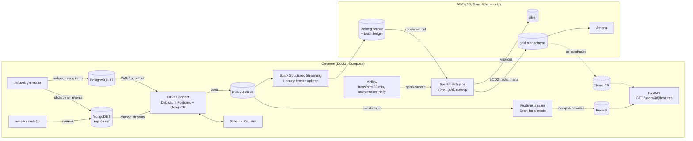

# theLook CDC Lakehouse

Real-time change data capture from an operational PostgreSQL database and a
MongoDB document store into a governed, cost-controlled Apache Iceberg
lakehouse on AWS, with Spark for processing and Redis/Neo4j for serving.

> **Status:** P1 to P5 are built and tested: capture from PostgreSQL and
> MongoDB, bronze/silver/gold on AWS with Spark and Airflow, and online
> user features in Redis served by FastAPI. Next is P6 (Neo4j co-purchase
> recommendations). This is a learning project; the full specification is
> the [cahier des charges](docs/cahier-des-charges.md) (v2.1), the
> reasoning is in the [ADRs](docs/adr/), measured results in
> [results](docs/results.md).


## Architecture

Solid boxes are built; dashed ones are planned (phase in brackets).
More diagrams, from deployment down to single mechanisms (CDC sequence,
exactly-once bronze, gold star schema, orchestration, Redis and Neo4j
serving): [docs/architecture.md](docs/architecture.md).



| Component | Built in | Topics / location |
|---|---|---|
| PostgreSQL capture (5 tables + heartbeat) | P1 | `thelook.shop.<table>` |
| MongoDB capture (`events`, `reviews`) | P2 | `thelook_mongo.web.<collection>` |
| S3 bucket, Glue databases, Athena workgroup, budgets | P2 (Terraform) | `infra/terraform/lake` |
| Monitoring: slot, connector and Debezium lag alerts | P1 | Prometheus, Alertmanager |
| CI: ruff, pytest, alert-rule tests | P2 | `.github/workflows/ci.yml` |
| Bronze: Spark Structured Streaming -> 7 Iceberg tables (S3 + Glue), queryable in Athena | P3 | `lake.thelook_bronze.<database>_<table>` |
| Silver: incremental MERGE, latest version per key (batch IAM user) | P4 | `lake.thelook_silver.<table>`, `make spark-run JOB=jobs/silver.py` |
| Gold: star schema (dim_user SCD2, facts, marts) | P4 | `lake.thelook_gold.*`, `make spark-run JOB=jobs/gold.py` |
| Orchestration: `transform` (silver -> gold, every 30 min), `maintenance` (silver/gold upkeep, daily), one-slot pool `lake` | P4 | `airflow/dags/`, UI `http://localhost:8088` |
| Table upkeep: bronze by the stream (hourly expiry, rotating compaction and orphan removal), silver/gold by the `maintenance` DAG | P4 | `spark/lakehouse/upkeep.py` |
| Durability: Kafka fsyncs every write; verify drill + key-filtered re-snapshot after an unclean shutdown | P4 | `drills/verify_silver.py`, `drills/resnapshot.py` |
| Online user features: last 10 products viewed (72 h), current cart, events in the last hour; a separate Spark stream into Redis (ACL users, AOF) | P5 | `spark/jobs/features_stream.py`, keys `user:{id}:*` |
| Serving API: `GET /users/{id}/features` (404 unknown, 503 Redis down), OpenAPI docs | P5 | `api/`, `http://localhost:8000/docs` |

## Repository layout

Folders are added in the commit that first needs them.

| Path | Contents | Phase |
|---|---|---|
| `onprem/` | Docker Compose stack: Postgres, MongoDB, generator, review simulator, Kafka, Schema Registry, Kafka Connect, monitoring | P1, P2 |
| `onprem/generator/` | Vendored theLook generator with our patches (see its `NOTICE`) | P1, P2 |
| `onprem/review-simulator/` | Synthetic reviews in MongoDB | P2 |
| `onprem/mongo/` | Replica set keyfile wrapper and idempotent setup (users, collections) | P2 |
| `infra/terraform/` | AWS resources: S3, Glue, Athena, budgets (IAM in P3) | P2 |
| `spark/` | PySpark jobs (streaming bronze, silver, gold, features) and their tests | P3, P4, P5 |
| `api/` | Serving API (FastAPI) and its tests | P5 |
| `onprem/redis/` | Redis configuration and ACL users | P5 |
| `drills/` | Reconciliation and failure drills | P1 onwards |
| `scripts/` | Helpers (cost report, one-off event history copy) | P1 onwards |
| `.github/workflows/` | CI | P2 onwards |
| `docs/` | Specification, ADRs, learning log, runbook, results, source schema | All |

## Run it

Needs Docker with Compose v2, [uv](https://docs.astral.sh/uv/), and RAM for
the profiles you start (measured with `docker stats`, generator at 5/s; it
counts page cache for Kafka and MongoDB, so it is an upper bound):

| Profile | Services | RAM |
|---|---|---|
| `core` | postgres, mongo, generator, review-simulator, kafka, schema-registry, connect | ~4.6 GB (mongo 1.1, kafka 1.0, postgres 0.9, connect 0.8, registry 0.7) |
| `monitoring` | postgres-exporter, prometheus, alertmanager | ~0.1 GB (Prometheus grows with its 7-day history) |
| `stream` | spark-master, spark-worker | ~0.5 GB idle; executors up to the worker's 3 GB cap, plus ~1 GB per driver |
| `airflow` | airflow-db, -apiserver, -scheduler, -dag-processor | ~0.9 GB idle; the scheduler (capped at 3 GB) hosts the Spark drivers |
| `serving` | redis, features-stream, api | ~1.5 GB (features-stream 1.3-1.4 GB, capped at 2 GB; Redis ~60 MB; API ~45 MB); needs `core`, not `stream`; no AWS access |

```bash
cp onprem/.env.example onprem/.env     # then set every password
make up PROFILES="core monitoring"     # starts and waits until healthy
onprem/postgres/apply-sql.sh onprem/postgres/cdc-setup.sql         # Debezium role + publication
onprem/postgres/apply-sql.sh onprem/postgres/monitoring-setup.sql  # exporter role
onprem/postgres/apply-sql.sh onprem/postgres/reviewer-setup.sql    # review simulator role
make register-connectors               # Debezium Postgres + MongoDB, then status
make up PROFILES="core stream"         # adds the Spark cluster (UI http://localhost:8080)
make spark-run JOB=jobs/smoke_test.py  # Kafka, Avro and Glue catalog checks on the cluster
make up PROFILES="core stream airflow" # adds Airflow: UI http://localhost:8088 (user admin, AIRFLOW_ADMIN_PASSWORD)
make snapshot-postgres                 # P3: blocking re-snapshot so bronze starts complete
make up PROFILES="core serving"        # P5: Redis, features stream, API (http://localhost:8000/docs)
# bronze-stream (stream profile) appends every CDC topic to lake.thelook_bronze.* every 60 s
make ps                                # what is running
make down                              # stop everything, keep the data
```

The `transform` and `maintenance` DAGs start paused on a fresh Airflow
database: unpause them in the UI. **Data transfer:** Spark on the laptop
reads S3 over the internet, ~0.8 GB per hour with `stream` and `airflow` up
(the free allowance covers ~125 hours a month): run those profiles while
working or demoing, `make down` otherwise. Always stop with `make down`: a
killed Kafka (sleep, crash) triggers the verify drill (runbook).

The SQL scripts need the generator's tables, which it creates on its first
start; if one reports a missing table, run it again a few seconds later
(all are idempotent). MongoDB needs no manual step: the one-shot
`mongo-init` service initiates the replica set and creates the users on
every `up`. The review simulator logs errors and retries until its Postgres
role exists. After a reboot, rerun `make up` (no restart policy on purpose).

| What | Where |
|---|---|
| Change events (Avro) | Kafka `localhost:9092`: `thelook.shop.<table>`, `thelook_mongo.web.<collection>` |
| Schemas | Schema Registry `http://localhost:8081/subjects` |
| Connector state | `make connector-status`, Connect REST `http://localhost:8083` |
| MongoDB | `mongodb://localhost:27017/?directConnection=true` (`directConnection`: the replica set member is named `mongo`, which only resolves inside Compose) |
| Metrics and alerts | Prometheus `http://localhost:9090`, Alertmanager `http://localhost:9093` |

Checks and drills: `uv run drills/verify_cdc.py [source ...]` (Kafka vs
both databases, with the generator and review simulator stopped),
`uv run drills/verify_silver.py` (silver vs both databases, every column),
`uv run drills/freshness.py` (O1) and `uv run drills/gold_freshness.py` (O2),
`drills/slot-drill.sh`, `drills/throughput-baseline.sh`. Results in
[docs/results.md](docs/results.md), procedures in
[docs/runbook.md](docs/runbook.md).

## How to demo P2 (about 3 minutes)

```bash
make up && make connector-status            # 2 connectors RUNNING
# 1. A document written to MongoDB is a Kafka event within a second:
docker compose -f onprem/compose.yaml exec schema-registry \
  kafka-avro-console-consumer --bootstrap-server kafka:29092 \
  --topic thelook_mongo.web.reviews --property schema.registry.url=http://localhost:8081
#    -> c (new review), u (helpful vote, edit: full document in "after"), d + tombstone
# 2. Schemaless documents: "after" is a JSON string; only cart events carry
#    product_id and price. Show one event and one review side by side.
# 3. Correctness: stop the writers, then prove Kafka = sources, all 7:
docker compose -f onprem/compose.yaml stop generator review-simulator
uv run drills/verify_cdc.py                 # ALL OK (about 3 minutes)
# 4. Show it can fail: stop connect, change a review in MongoDB, run
#    `verify_cdc.py reviews` (differ=1), start connect, run it again (OK).
```

Talking points: why a replica set for one node, oplog vs replication slot,
why `thelook_mongo` and not `thelook-mongo` (Avro names), why the history
was copied before the connector's snapshot.

## How to demo P4 (about 3 minutes)

With `core stream airflow` up and both DAGs unpaused:

```bash
# 1. Airflow UI (http://localhost:8088): transform green every 30 minutes,
#    silver -> gold_dims -> gold_facts -> gold_marts; maintenance daily.
# 2. Gold answers questions in Athena (workgroup thelook), e.g. revenue by
#    country *as the customer's address was when they ordered* (SCD2):
#    SELECT u.country, sum(f.gross_amount) FROM thelook_gold.fct_order_items f
#    JOIN thelook_gold.dim_user u ON f.user_sk = u.user_sk GROUP BY 1
# 3. Freshness: a just-committed order reaches gold in under an hour (O2):
uv run drills/gold_freshness.py
# 4. Correctness: stop the writers, let bronze go idle, run silver, then
#    prove silver = sources, every column of all 7 tables:
uv run drills/verify_silver.py              # ALL OK (about 7 minutes)
```

Talking points: the 16 seconds Kafka lost in a crash and how they were found
and repaired (exactly-once assumes the broker keeps what it acknowledged);
the batch ledger and consistent cut; why silver's watermark is an
`ingested_at`, not a snapshot id; merge-on-read and why maintenance is
not optional (a 487 KB metadata file slowed the stream); what each run
costs in S3 transfer and why it does not go lower (random keys).

## How to demo P5 (about 3 minutes)

With `core serving` up (no AWS cost):

```bash
# 1. A user's features, typed and documented (http://localhost:8000/docs):
curl -s localhost:8000/users/<user id>/features | python3 -m json.tool
#    (a user id: redis-cli as admin, SCAN 0 MATCH user:*:viewed)
# 2. Freshness: the next product view by a real user is served within
#    ~10 s of its MongoDB commit (target < 1 minute), API p99 ~4 ms:
uv run drills/features_freshness.py 5
# 3. Correctness by construction: rebuild everything from Kafka and compare
#    with what the live stream built, key by key, expiry to the millisecond:
uv run drills/features_rebuild.py           # 224,587 / 224,587 identical
# 4. Isolation: stop Redis for 5 minutes; the API answers 503 in 1 s, the
#    stream restarts and catches up, bronze never notices:
uv run drills/redis_outage.py 300
```

Talking points: why sorted sets with `ZADD GT` and not list pushes (a
replayed batch must change nothing); "events in the last hour" counted at
read time, not with `INCR`; TTLs from event time, so a rebuild gives the
same expiries; a TTL bounds a key, not its members (the 72 h window on
viewed); why `failOnDataLoss=false` here and `true` for bronze; the 503 that
took 60 s (redis-py's default retries and DNS for a stopped container).

## Design decisions

Each has an ADR with the alternatives and consequences.

| Decision | Why | ADR |
|---|---|---|
| Self-hosted Kafka, not Kinesis/MSK | Industry standard, $0 locally (MSK Serverless ~$540/month) | [001](docs/adr/001-kafka-over-kinesis.md) |
| Postgres: pgoutput, pre-created publication, slot cap | No plugin to install; Debezium never owns tables; a stalled slot cannot fill the disk | [002](docs/adr/002-postgres-source-configuration.md), [004](docs/adr/004-cdc-access-model.md) |
| Connect image built from apache/kafka + checksummed plugins | One Kafka version everywhere; explicit supply chain | [003](docs/adr/003-kafka-connect-worker-image.md) |
| Prometheus + Alertmanager on-prem | Slot and lag alerts with unit-tested rules | [005](docs/adr/005-on-prem-monitoring.md) |
| Bronze tables created by their writer, validated by contracts | New nullable columns flow without a deploy | [006](docs/adr/006-bronze-table-ownership.md) |
| Spark Structured Streaming writes bronze; Iceberg, not Delta | One engine for stream and batch; Athena writes Iceberg (MERGE, VACUUM), only reads Delta | [007](docs/adr/007-spark-streaming-bronze-writer.md) |
| MongoDB holds clickstream and reviews, one document per event | One source of truth per dataset; append-only inserts, not growing session documents | [008](docs/adr/008-mongodb-second-cdc-source.md) |
| PySpark builds silver and gold, not dbt | One engine, logic unit-tested with pytest + chispa | [009](docs/adr/009-pyspark-instead-of-dbt.md) |
| Redis + Neo4j + FastAPI serving layer | Each store fits its access pattern; TTLs bound personal data | [010](docs/adr/010-serving-layer.md) |
| Spark 4.1 + Iceberg 1.12, jars baked and checksummed in one image | Driver and executors on one Python; no download at run time | [011](docs/adr/011-spark-runtime-and-versions.md) |
| Bronze: one table per source table, envelope kept, replay guard, batch ledger | Exactly-once appends; silver reads a consistent cut across tables | [012](docs/adr/012-bronze-table-design.md) |
| Airflow on the Spark image, spark-submit in client mode | Same Python as the executors; no Docker socket in Airflow | [013](docs/adr/013-airflow-runtime.md) |
| Silver: incremental MERGE by log position, merge-on-read, `ingested_at` watermark | Idempotent replays; reads only new bronze files | [014](docs/adr/014-silver-design.md) |
| Gold: star schema, dim_user SCD2 rebuilt each run, unknown member, written metric definitions | Orders keep the address of their time; inner joins drop nothing | [015](docs/adr/015-gold-model.md) |
| Kafka fsyncs every write (single broker) | No silent loss of acknowledged records on a crash (one happened) | [016](docs/adr/016-kafka-fsync-single-broker.md) |
| Each layer maintained by its writer | No key that can delete bronze ever enters Airflow | [017](docs/adr/017-table-maintenance.md) |
| Features: a separate Spark stream in local mode; max/union values in Redis; TTLs from event time | No AWS key, cannot slow bronze; replays and rebuilds give the same state | [018](docs/adr/018-online-features.md) |

## After cloning

Enable the versioned Git hooks once per clone. The pre-push hook scans the
commits being pushed with gitleaks (in Docker) and blocks the push if it
finds a secret:

```bash
git config core.hooksPath .githooks
```

## Documentation

- [Cahier des charges](docs/cahier-des-charges.md)
- [Architecture decision records](docs/adr/)
- [Learning log](docs/learning-log.md)
- [Source schema](docs/source-schema.md)
- [Results](docs/results.md) and [runbook](docs/runbook.md)

## License

Apache License 2.0, see [LICENSE](LICENSE). The vendored generator is
Apache 2.0 too (Factor House); see `onprem/generator/NOTICE`.
