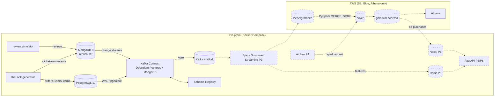

# theLook CDC Lakehouse

Real-time change data capture from an operational PostgreSQL database and a
MongoDB document store into a governed, cost-controlled Apache Iceberg
lakehouse on AWS, with Spark for processing and Redis/Neo4j for serving.

> **Status:** P1 (Postgres capture) and P2 (MongoDB as a second CDC source)
> are built and tested; next is P3, Spark Structured Streaming into the
> Iceberg bronze layer on AWS. This is a learning project; the full
> specification is the [cahier des charges](docs/cahier-des-charges.md)
> (v2.0), the reasoning is in the [ADRs](docs/adr/).


## Architecture

Solid boxes are built; dashed ones are planned (phase in brackets).



| Component | Built in | Topics / location |
|---|---|---|
| PostgreSQL capture (5 tables + heartbeat) | P1 | `thelook.shop.<table>` |
| MongoDB capture (`events`, `reviews`) | P2 | `thelook_mongo.web.<collection>` |
| S3 bucket, Glue databases, Athena workgroup, budgets | P2 (Terraform) | `infra/terraform/lake` |
| Monitoring: slot, connector and Debezium lag alerts | P1 | Prometheus, Alertmanager |
| CI: ruff, pytest, alert-rule tests | P2 | `.github/workflows/ci.yml` |

## Repository layout

Folders are added in the commit that first needs them.

| Path | Contents | Phase |
|---|---|---|
| `onprem/` | Docker Compose stack: Postgres, MongoDB, generator, review simulator, Kafka, Schema Registry, Kafka Connect, monitoring | P1, P2 |
| `onprem/generator/` | Vendored theLook generator with our patches (see its `NOTICE`) | P1, P2 |
| `onprem/review-simulator/` | Synthetic reviews in MongoDB | P2 |
| `onprem/mongo/` | Replica set keyfile wrapper and idempotent setup (users, collections) | P2 |
| `infra/terraform/` | AWS resources: S3, Glue, Athena, budgets (IAM in P3) | P2 |
| `spark/` | PySpark jobs (streaming bronze, silver, gold) and their tests | P3, P4 |
| `drills/` | Reconciliation and failure drills | P1 onwards |
| `scripts/` | Helpers (cost report, one-off event history copy) | P1 onwards |
| `.github/workflows/` | CI | P2 onwards |
| `docs/` | Specification, ADRs, learning log, runbook, results, source schema | All |

## Run it

Needs Docker with Compose v2, [uv](https://docs.astral.sh/uv/), and RAM for
the profiles you start (measured with `docker stats`, generator at 5/s; it
counts page cache for Kafka and MongoDB, so it is an upper bound):

| Profile | Services | RAM |
|---|---|---|
| `core` | postgres, mongo, generator, review-simulator, kafka, schema-registry, connect | ~4.6 GB (mongo 1.1, kafka 1.0, postgres 0.9, connect 0.8, registry 0.7) |
| `monitoring` | postgres-exporter, prometheus, alertmanager | ~0.1 GB (Prometheus grows with its 7-day history) |
| `stream` | spark-master, spark-worker | ~0.5 GB idle; executors up to the worker's 3 GB cap, plus ~1 GB per driver |

```bash
cp onprem/.env.example onprem/.env     # then set every password
make up PROFILES="core monitoring"     # starts and waits until healthy
onprem/postgres/apply-sql.sh onprem/postgres/cdc-setup.sql         # Debezium role + publication
onprem/postgres/apply-sql.sh onprem/postgres/monitoring-setup.sql  # exporter role
onprem/postgres/apply-sql.sh onprem/postgres/reviewer-setup.sql    # review simulator role
make register-connectors               # Debezium Postgres + MongoDB, then status
make up PROFILES="core stream"         # adds the Spark cluster (UI http://localhost:8080)
make spark-run JOB=jobs/smoke_test.py  # Kafka, Avro and Glue catalog checks on the cluster
make ps                                # what is running
make down                              # stop everything, keep the data
```

The SQL scripts need the generator's tables, which it creates on its first
start; if one reports a missing table, run it again a few seconds later
(all are idempotent). MongoDB needs no manual step: the one-shot
`mongo-init` service initiates the replica set and creates the users on
every `up`. The review simulator logs errors and retries until its Postgres
role exists. After a reboot, rerun `make up` (no restart policy on purpose).

| What | Where |
|---|---|
| Change events (Avro) | Kafka `localhost:9092`: `thelook.shop.<table>`, `thelook_mongo.web.<collection>` |
| Schemas | Schema Registry `http://localhost:8081/subjects` |
| Connector state | `make connector-status`, Connect REST `http://localhost:8083` |
| MongoDB | `mongodb://localhost:27017/?directConnection=true` (`directConnection`: the replica set member is named `mongo`, which only resolves inside Compose) |
| Metrics and alerts | Prometheus `http://localhost:9090`, Alertmanager `http://localhost:9093` |

Checks and drills: `uv run drills/verify_cdc.py [source ...]` (Kafka vs
both databases, with the generator and review simulator stopped),
`drills/slot-drill.sh`, `drills/throughput-baseline.sh`. Results in
[docs/results.md](docs/results.md), procedures in
[docs/runbook.md](docs/runbook.md).

## How to demo P2 (about 3 minutes)

```bash
make up && make connector-status            # 2 connectors RUNNING
# 1. A document written to MongoDB is a Kafka event within a second:
docker compose -f onprem/compose.yaml exec schema-registry \
  kafka-avro-console-consumer --bootstrap-server kafka:29092 \
  --topic thelook_mongo.web.reviews --property schema.registry.url=http://localhost:8081
#    -> c (new review), u (helpful vote, edit: full document in "after"), d + tombstone
# 2. Schemaless documents: "after" is a JSON string; only cart events carry
#    product_id and price. Show one event and one review side by side.
# 3. Correctness: stop the writers, then prove Kafka = sources, all 7:
docker compose -f onprem/compose.yaml stop generator review-simulator
uv run drills/verify_cdc.py                 # ALL OK (about 3 minutes)
# 4. Show it can fail: stop connect, change a review in MongoDB, run
#    `verify_cdc.py reviews` (differ=1), start connect, run it again (OK).
```

Talking points: why a replica set for one node, oplog vs replication slot,
why `thelook_mongo` and not `thelook-mongo` (Avro names), why the history
was copied before the connector's snapshot.

## Design decisions

Each has an ADR with the alternatives and consequences.

| Decision | Why | ADR |
|---|---|---|
| Self-hosted Kafka, not Kinesis/MSK | Industry standard, $0 locally (MSK Serverless ~$540/month) | [001](docs/adr/001-kafka-over-kinesis.md) |
| Postgres: pgoutput, pre-created publication, slot cap | No plugin to install; Debezium never owns tables; a stalled slot cannot fill the disk | [002](docs/adr/002-postgres-source-configuration.md), [004](docs/adr/004-cdc-access-model.md) |
| Connect image built from apache/kafka + checksummed plugins | One Kafka version everywhere; explicit supply chain | [003](docs/adr/003-kafka-connect-worker-image.md) |
| Prometheus + Alertmanager on-prem | Slot and lag alerts with unit-tested rules | [005](docs/adr/005-on-prem-monitoring.md) |
| Bronze tables created by their writer, validated by contracts | New nullable columns flow without a deploy | [006](docs/adr/006-bronze-table-ownership.md) |
| Spark Structured Streaming writes bronze; Iceberg, not Delta | One engine for stream and batch; Athena writes Iceberg (MERGE, VACUUM), only reads Delta | [007](docs/adr/007-spark-streaming-bronze-writer.md) |
| MongoDB holds clickstream and reviews, one document per event | One source of truth per dataset; append-only inserts, not growing session documents | [008](docs/adr/008-mongodb-second-cdc-source.md) |
| PySpark builds silver and gold, not dbt | One engine, logic unit-tested with pytest + chispa | [009](docs/adr/009-pyspark-instead-of-dbt.md) |
| Redis + Neo4j + FastAPI serving layer | Each store fits its access pattern; TTLs bound personal data | [010](docs/adr/010-serving-layer.md) |

## After cloning

Enable the versioned Git hooks once per clone. The pre-push hook scans the
commits being pushed with gitleaks (in Docker) and blocks the push if it
finds a secret:

```bash
git config core.hooksPath .githooks
```

## Documentation

- [Cahier des charges](docs/cahier-des-charges.md)
- [Architecture decision records](docs/adr/)
- [Learning log](docs/learning-log.md)
- [Source schema](docs/source-schema.md)

## License

Apache License 2.0, see [LICENSE](LICENSE). The vendored generator is
Apache 2.0 too (Factor House); see `onprem/generator/NOTICE`.
