# Architecture in diagrams

Ten diagrams, from the whole system down to single mechanisms. Each one is
drawn from the code and the ADRs, with the measured figures from
[results](results.md); the reasoning behind each choice is in the
[ADRs](adr/). GitHub renders the Mermaid blocks; the text under each one
says how to read it and what to remember.

1. [The whole system](#1-the-whole-system)
2. [Where everything runs](#2-where-everything-runs)
3. [One change, from commit to Athena](#3-one-change-from-commit-to-athena)
4. [Exactly-once into bronze](#4-exactly-once-into-bronze)
5. [Medallion layers, table by table](#5-medallion-layers-table-by-table)
6. [The gold star schema](#6-the-gold-star-schema)
7. [Orchestration](#7-orchestration)
8. [Online features (Redis)](#8-online-features-redis)
9. [Co-purchase graph (Neo4j)](#9-co-purchase-graph-neo4j)
10. [Roadmap](#10-roadmap)

---

## 1. The whole system

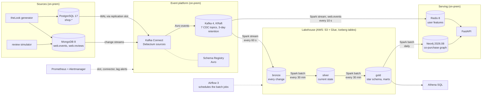

**How to read it.** Left to right is the path of the data; each arrow into a
store names the Spark job that writes it and how often. Two operational
databases change all the time; Debezium reads their change logs (never the
tables themselves, objective O3) and publishes every change to Kafka. From
Kafka, two independent Spark streams fan out: one lands every change in the
lake (bronze), the other keeps per-user features in Redis. Batch jobs,
scheduled by Airflow, turn bronze into silver and gold, and a daily job
turns gold into a graph.

**What to remember.**

- **Hybrid on purpose**: sources, Kafka and the engines run locally (a
  company's own data centre); AWS holds only storage, catalog and SQL
  (S3, Glue, Athena), which keeps the bill under O6's \$15 a month.
- **One lake, no local copy**: Spark reads and writes Iceberg on S3 through
  Glue, so Athena sees each commit at once (spec 5.1).
- **Kafka decouples everything**: a slow lake never slows the features, and
  any consumer can be rebuilt by replaying the topic (3 days kept).

---

## 2. Where everything runs

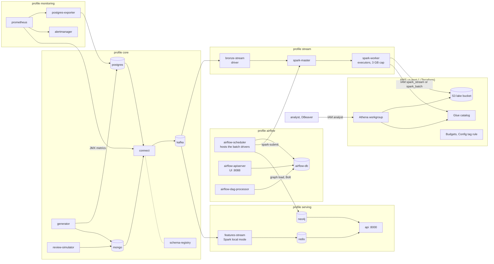

**How to read it.** Each box is a Compose service on the laptop, grouped by
the profile that starts it (`make up PROFILES="core serving"`); the AWS box
is the only part outside the machine, and the arrows into it are the only
traffic that leaves it.

**What to remember.**

- **Profiles = cost control**: `core` + `serving` demo P5 and P6 with no AWS
  traffic at all; `stream` and `airflow` read and write S3 (~0.8 GB an
  hour), so they run only while working.
- **Least privilege, three identities**: the bronze writer, the batch jobs
  and the analyst each have their own IAM user and policy; no AWS key sits
  in Airflow (each job loads its identity from the scheduler's environment).
- **Drivers vs executors**: the driver plans the job (in `bronze-stream` or
  the Airflow scheduler); executors on `spark-worker` do the reading and
  writing. The graph load is the exception: one writer, from the driver
  (ADR 019).

---

## 3. One change, from commit to Athena

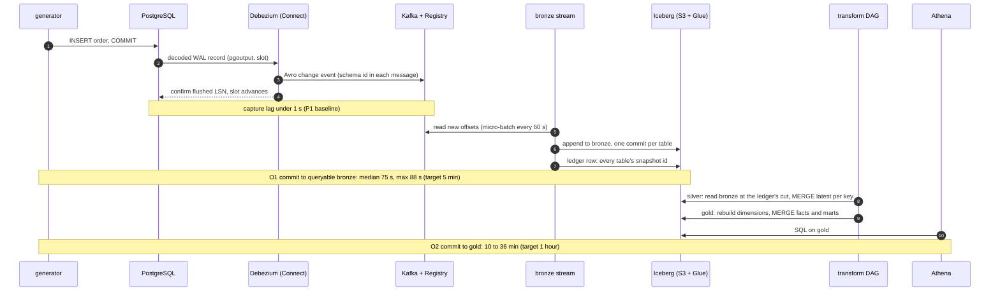

**How to read it.** Time runs downwards. Steps 1-4 are capture, 5-7 the
streaming ingestion, 8-10 the batch refinement.

**What to remember.**

- **Step 4 is why replication slots are dangerous**: PostgreSQL keeps WAL
  until Debezium confirms it. A stopped connector makes WAL pile up, hence
  `max_slot_wal_keep_size` and the slot alerts (P1 drill).
- **Step 7 makes silver consistent**: the ledger row is written only after
  every table of the batch has committed, so silver reads all tables as of
  the same batch (an order item is never merged without its order).
- **Freshness is bounded by the schedules**: ~60 s trigger + batch time for
  bronze; up to one 30-minute interval + one run for gold.

---

## 4. Exactly-once into bronze

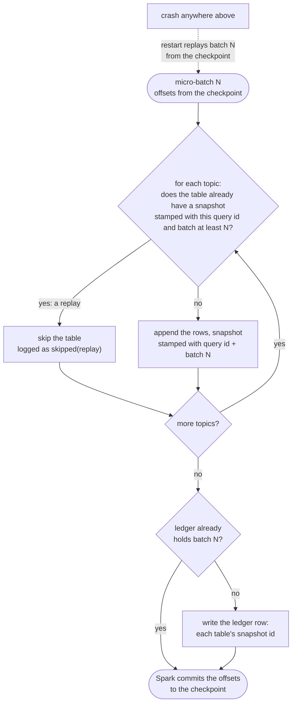

**How to read it.** Spark's checkpoint guarantees that a batch is processed
*at least* once: after a crash, batch N runs again with the same offsets.
The stamps turn that into *exactly once*: each Iceberg commit carries the
query id and batch id in its snapshot summary, so a replayed batch finds
its own earlier commits and skips them, table by table.

**What to remember.**

- **Idempotence lives in the sink**, not in Kafka: the commit and its stamp
  are one atomic Iceberg snapshot, so "written" and "marked written" can
  never disagree.
- A **new checkpoint means a new query id**: the guard no longer matches,
  bronze gets duplicates, and silver removes them by log position (ADR 012).
- Measured in P3: a killed and restarted stream appended no duplicates.

---

## 5. Medallion layers, table by table

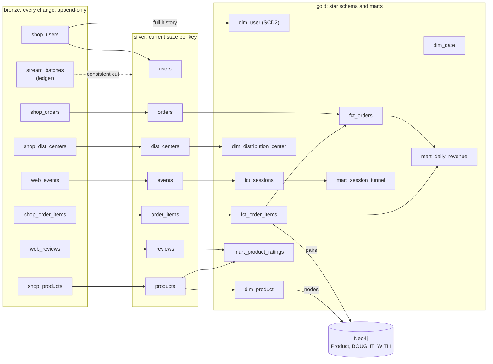

**How to read it.** Bronze keeps every change event as it arrived (inserts,
updates, deletes, with their log position). Silver keeps the latest version
of each row (MERGE on the key, deletes applied). Gold reshapes silver for
analysis.

**What to remember.**

- **`dim_user` reads bronze, not silver**: silver has only the current
  address; SCD2 history needs every change, and bronze is that history.
- **Silver is incremental** (only rows ingested since its watermark);
  dimensions are rebuilt every run (small, always consistent); facts and
  marts are MERGEd for what changed (ADR 014, ADR 015).
- `web_events` is partitioned by day in silver; bronze is partitioned by
  commit day (`source_ts`), hidden partitioning (ADR 012).

---

## 6. The gold star schema

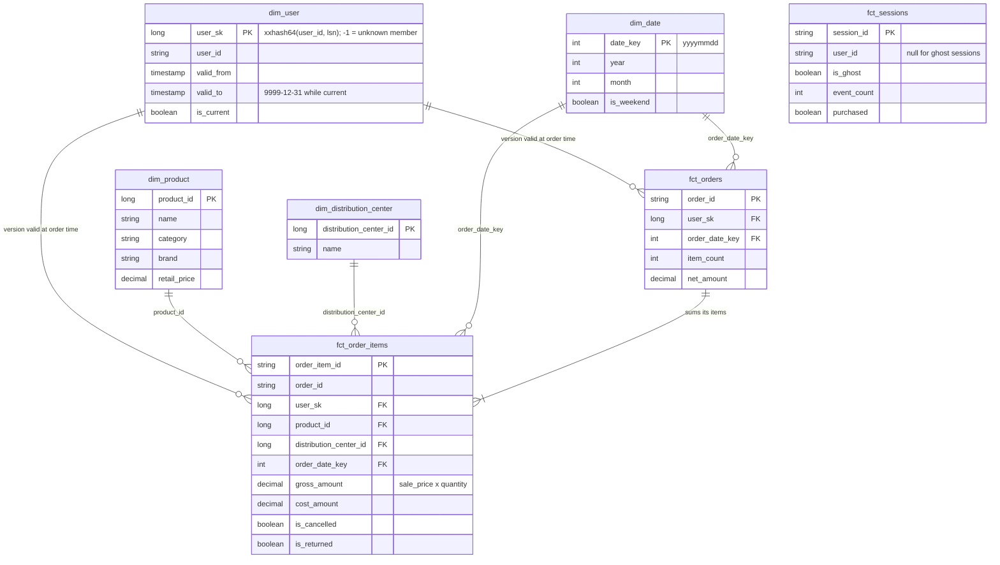

**How to read it.** Facts (events you count and sum) in the middle,
dimensions (who, what, where, when) around them. Only the main columns are
shown; `fct_sessions` stands alone (it joins on `user_id` when it needs to).

**What to remember.**

- **SCD2 join**: an order joins the user version that was valid when it was
  placed (`created_at >= valid_from AND created_at < valid_to`), so revenue
  by city stays right after a user moves.
- **Unknown member** (`user_sk = -1`, Kimball): an order whose user version
  is not there yet still joins, as "Unknown", and is repaired on a later
  run instead of being dropped by an inner join.
- **Metric definitions live in one place** (ADR 015): gross revenue
  excludes cancelled items, net revenue subtracts returns, session
  conversion excludes ghost sessions.

---

## 7. Orchestration

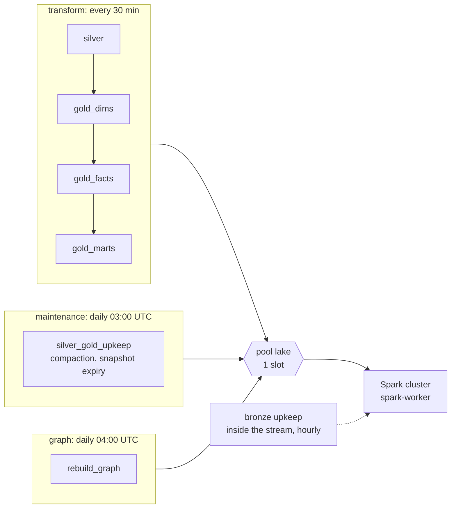

```mermaid
gantt
  title One slot, one job at a time (measured durations, illustrative order)
  dateFormat HH:mm
  axisFormat %H:%M
  section pool lake
  maintenance 2.6 min              :m, 03:00, 3m
  transform 03.00 waits then runs  :t1, after m, 7m
  transform 03.30                  :t2, 03:30, 7m
  graph 64 s                       :g, 04:00, 1m
  transform 04.00 waits then runs  :t3, after g, 7m
```

**How to read it.** Three DAGs, each task one `spark-submit`. All of them
take the single slot of the `lake` pool, so two jobs never run on the lake
at once; a job scheduled while another holds the slot waits its turn.

**What to remember.**

- **Why one slot**: a compaction committing while a MERGE rewrites the same
  table would make one of them fail and retry (ADR 017); it also stops the
  batch jobs from taking the worker's last cores.
- `max_active_runs=1` and `catchup=False`: runs never overlap, and after
  downtime the next run's incremental read covers the missed slots instead
  of replaying them one by one.
- Bronze is maintained by its own stream (it is the only writer), not by
  Airflow (ADR 017).

---

## 8. Online features (Redis)

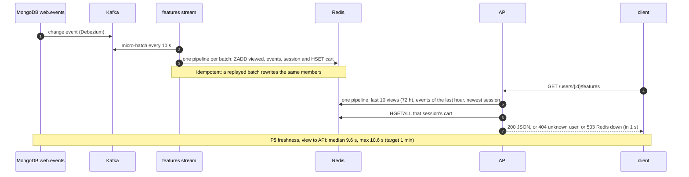

| Redis key | Type | Holds |
|---|---|---|
| `user:{id}:viewed` | sorted set | product id -> last view (epoch ms), last 72 h |
| `user:{id}:events` | sorted set | event id -> event time, counted at read time |
| `user:{id}:session` | sorted set | session id -> its last event |
| `user:{id}:cart:{session}` | hash | `item:<event id>` -> price, `purchased` -> 1 |

**What to remember.**

- **Sorted sets keyed by event id** make writes idempotent: replaying a
  batch sets the same members to the same scores.
- **"Events in the last hour" is counted when read**, so it falls as time
  passes even if the user does nothing (a stored counter would not).
- **Least privilege in Redis too**: the stream writes as `features`, the
  API reads as `api` (ACL users), `default` is disabled.

---

## 9. Co-purchase graph (Neo4j)

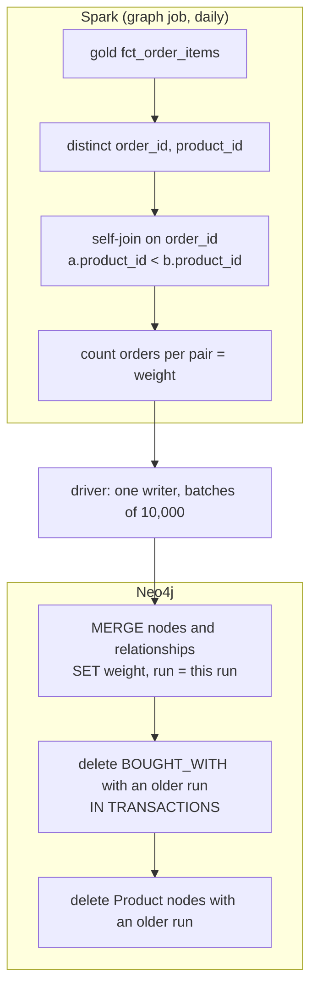

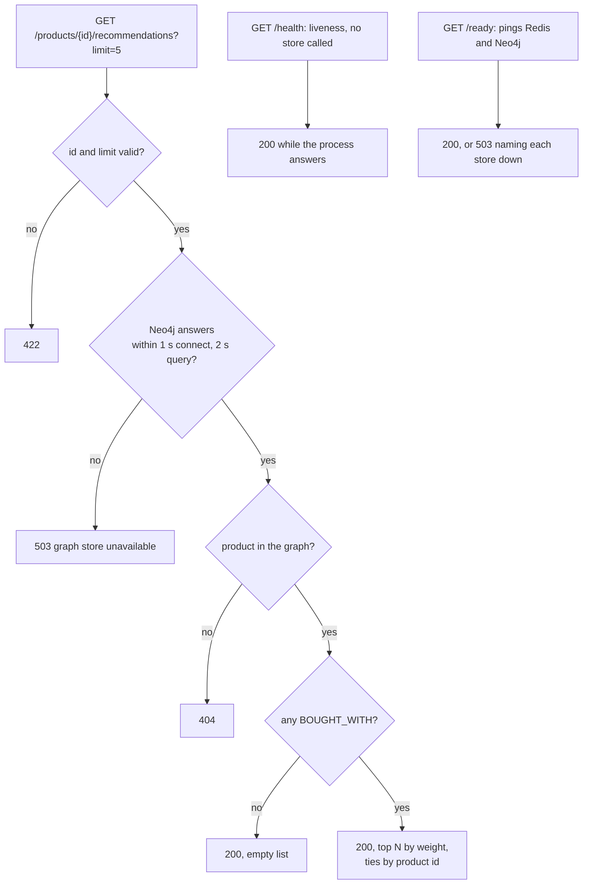

**How to read it.** The first diagram builds the graph; the second is what
one request can return.

**What to remember.**

- **Full rebuild, not increments**: weights must be able to go *down*
  (erasure, P8), and `weight += n` counts a replayed batch twice. Recomputing
  every pair from gold is idempotent by construction: same input, same
  graph (measured: same fingerprint on three runs).
- **Write first, delete after**: the old graph stays readable until the new
  run has fully written, so the API never sees an empty graph.
- **One writer**: parallel `MERGE`s on the same popular products would
  deadlock on node locks.
- Measured: 491,014 pairs, 29,120 products, 55 s per run; the top product's
  5 neighbours are exactly its 5 companions (weights 34-43, the next is 2).
- **Fail fast**: 503 in about a second with Neo4j stopped; `/health` stays
  200 so a store outage never gets a working API restarted (ADR 019
  amendment).

---

## 10. Roadmap

```mermaid
flowchart LR
  P1["P1 CDC from PostgreSQL<br/>Kafka, Debezium, slot safety"]:::done
  P2["P2 MongoDB source<br/>Terraform, CI"]:::done
  P3["P3 bronze on AWS<br/>Spark streaming, Iceberg"]:::done
  P4["P4 silver, gold, Airflow"]:::done
  P5["P5 Redis features, API"]:::done
  P6["P6 Neo4j recommendations"]:::active
  P7["P7 data contracts, quality,<br/>schema evolution"]:::planned
  P8["P8 GDPR erasure, backfill,<br/>failure drills"]:::planned
  P9["P9 hardening, load test,<br/>CI/CD, docs"]:::planned
  P10["P10 optional: Kinesis,<br/>Managed Flink"]:::optional
  P1 --> P2 --> P3 --> P4 --> P5 --> P6 --> P7 --> P8 --> P9 --> P10
  classDef done fill:#d4edda,stroke:#2e7d32,color:#1b4d20
  classDef active fill:#fff3cd,stroke:#b8860b,color:#5c4400
  classDef planned fill:#ffffff,stroke:#888888,stroke-dasharray: 5 5,color:#333333
  classDef optional fill:#ffffff,stroke:#bbbbbb,stroke-dasharray: 2 4,color:#777777
```

Green: built and accepted. Yellow: in progress (P6 acceptance run pending).
Dashed: planned. P1 to P4 form the core project; P5 and P6 add serving; P10
only makes sense after P9 (spec section 9).
